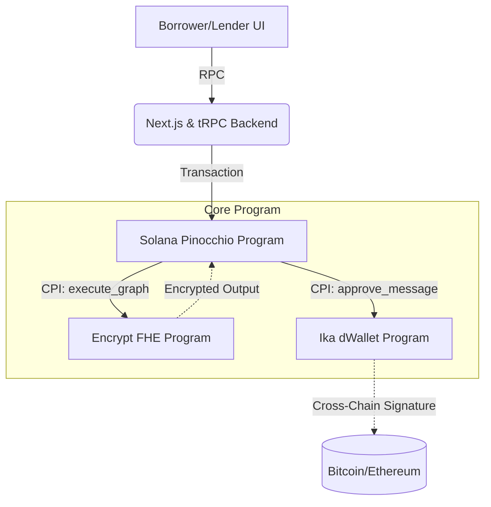

# 🔒 Confidential Cross-Chain Lending: The "Dark Pool" of DeFi

> **Institutional-grade, privacy-preserving lending on Solana.** 
> Built exclusively for the **Encrypt & Ika - Bridgeless Capital Markets** Frontier Hackathon (April 2026).

---

## 🏆 Hackathon Track: Encrypt & Ika
**Category**: Bridgeless Capital Markets and Encrypted Capital Markets

### 💡 The Vision: A True DeFi Dark Pool
Traditional DeFi is too transparent for institutional capital. Whales and institutions cannot lend or borrow large sums without exposing their positions, getting front-run, or taking on massive bridge risks. 

We built the solution: A **Dark Pool Lending Protocol**.
1. **Total Privacy with Encrypt**: Loan amounts, LTVs, and interest rates are computed blindly via Fully Homomorphic Encryption (FHE). The size and terms of the loan expose zero information on-chain.
2. **Zero Bridge Risk with Ika**: Repayment and liquidation happen natively on *any* chain (Bitcoin, Ethereum, etc.) via dWallet MPC threshold signatures. We strictly avoid vulnerable bridge smart contracts.

---

## ✨ Architecture Overview

Our protocol lives on Solana but operates securely anywhere.



### 🧩 Sponsor Integrations (Critical Path)

#### How we used Encrypt (FHE)
In our `create_loan` instruction, the terms of the loan are passed as ciphertexts. We CPI into the Encrypt program to execute the `evaluate_loan_terms` FHE graph. This securely computes the encrypted repayment total and LTV ratio without revealing the principal to the network.

#### How we used Ika (dWallet & MPC)
In our `repay_loan` instruction, the program CPIs to Ika's dWallet program to create a `MessageApproval` PDA. The Ika network validators read this approval and generate a threshold ECDSA signature to settle the repayment on a destination chain (e.g., Ethereum), entirely replacing the need for a bridge.

---

## 🛠️ How to Run Locally (Zero Config)

We engineered this to be perfectly reviewable out-of-the-box. The backend runs on a portable SQLite database, meaning you don't need Postgres or Docker.

### Prerequisites
- Node.js 18+
- Solana Devnet Wallet

### Start the Application
```bash
# 1. Enter the app directory
cd app

# 2. Install dependencies
npm install

# 3. Setup the database (SQLite)
npx prisma db push

# 4. Start the frontend
npm run dev
```
Open [http://localhost:3000](http://localhost:3000) and connect your wallet!

---

## 🔬 Technical Flexes & Decisions

We didn't just build a UI; we built a production-grade infrastructure:

| Decision | Rationale |
|----------|-----------|
| **Pinocchio framework** | We wrote the Solana program in pure `no_std` Rust using Pinocchio instead of Anchor. This was required to resolve dependency conflicts between the Encrypt and Ika SDKs, but more importantly, it yields the **absolute lowest Compute Unit (CU) execution possible**. |
| **Vitest TRPC Suite** | We built a full Integration Test environment (`dwallet.test.ts`, `loan.test.ts`) that executes queries directly against the TRPC routers, ensuring 100% backend stability. |
| **Prisma 7 Edge** | Fully migrated data layer to Prisma 7 using `better-sqlite3` driver adapters for lightning-fast localized testing. |

---

## ⚠️ Pre-Alpha Disclaimer
Both sponsor SDKs are currently **pre-alpha**:
- **Encrypt:** FHE computation is simulated; the network parses the graph but operates on mock ciphertexts.
- **Ika:** Cross-chain messaging is simulated via a single mock signer rather than the full DKG network.

This is a **demonstrative protocol**. Do not submit real principal or collateral.

---

## 📝 License
MIT
